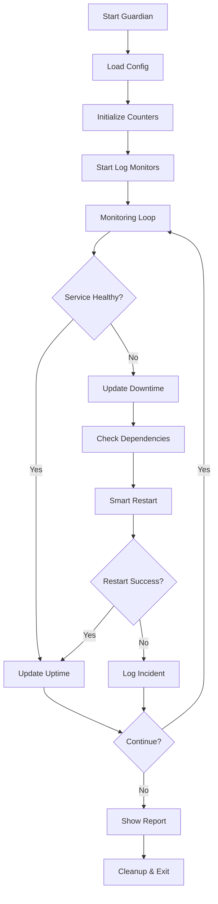

# Bash-Based High Availability Monitoring Auto-Healing System

A robust service monitoring and auto-healing system that monitors critical services (Nginx, MySQL, Redis) with intelligent restart capabilities, dependency management, and real-time health tracking.

## 🚀 Features

### ✅ Multi-Layer Health Checks
- **systemctl status** - Verifies service is active
- **Port listening** - Confirms service is bound to expected port
- **Application response** - Tests actual service functionality (ping, HTTP requests)

### 🔄 Smart Auto-Restart
- **Exponential backoff** - Prevents restart storms (2s, 4s, 8s, 16s delays)
- **Configurable retries** - Default 4 attempts before marking as failed
- **Dependency-aware** - Restarts dependencies before dependent services

### 📊 Real-Time Monitoring
- **Log parsing** - Detects errors/failures in service logs instantly
- **Uptime tracking** - Tracks service uptime and downtime
- **Availability calculation** - Calculates and reports availability percentage
- **Periodic reports** - Auto-generates availability reports every 5 minutes

### 🔗 Dependency Management
- **Smart restart order** - Restarts dependencies first (e.g., MySQL/Redis before Nginx)
- **Configurable dependencies** - Define service relationships in config file

## 📁 Project Structure

```
.
├── service_guardian.sh    # Main monitoring script
├── services.conf          # Service configuration file
├── service_health.log     # Health check logs
└── incidents.txt          # Incident and error logs
```

## ⚙️ Configuration

Edit `services.conf` to configure monitored services:

```bash
# MySQL
SERVICE_NAME=mysql
ENABLED=yes
PORT=3306
CHECK_CMD="mysqladmin ping"
DEPENDS_ON=
LOG_FILE=/var/log/mysql/error.log
---

# Redis
SERVICE_NAME=redis-server
ENABLED=yes
PORT=6379
CHECK_CMD="redis-cli ping"
DEPENDS_ON=
LOG_FILE=/var/log/redis/redis-server.log
---

# Nginx (depends on MySQL and Redis)
SERVICE_NAME=nginx
ENABLED=yes
PORT=80
CHECK_CMD="curl -sf http://localhost"
DEPENDS_ON=mysql,redis-server
LOG_FILE=/var/log/nginx/error.log
---
```

### Configuration Parameters

| Parameter | Description | Example |
|-----------|-------------|---------|
| `SERVICE_NAME` | systemd service name | `nginx` |
| `ENABLED` | Enable monitoring (yes/no) | `yes` |
| `PORT` | Port to check | `80` |
| `CHECK_CMD` | Command to verify service | `curl -sf http://localhost` |
| `DEPENDS_ON` | Comma-separated dependencies | `mysql,redis-server` |
| `LOG_FILE` | Path to service log file | `/var/log/nginx/error.log` |

## 🎯 Usage

### Start the Guardian

```bash
chmod +x service_guardian.sh
sudo ./service_guardian.sh
```

### Output Example

```
=========================================
  SERVICE GUARDIAN STARTED
=========================================
Monitoring: Nginx, MySQL, Redis
Check Interval: 5s
Logs: ./service_health.log | ./incidents.txt
=========================================

[Monitoring in progress...]
```

### Stop the Guardian

Press `Ctrl+C` to gracefully shutdown. The system will:
1. Display final availability report
2. Stop all log monitors
3. Save final state to logs

### View Availability Report

The system automatically generates availability reports every 5 minutes and on shutdown:

```
=========================================
  SERVICE AVAILABILITY REPORT
=========================================
Total Runtime: 15 minutes

[mysql]
  Uptime: 900s | Downtime: 0s
  Availability: 100.00%

[redis-server]
  Uptime: 895s | Downtime: 5s
  Availability: 99.44%

[nginx]
  Uptime: 900s | Downtime: 0s
  Availability: 100.00%
```

## 📝 Log Files

### service_health.log
Contains all health check events:
```
2026-02-10 22:30:15 | Service Guardian started
2026-02-10 22:30:15 | Started log monitor for mysql (/var/log/mysql/error.log)
2026-02-10 22:30:20 | mysql healthy
2026-02-10 22:30:20 | nginx healthy
```

### incidents.txt
Contains all incidents and restart attempts:
```
2026-02-10 22:35:42 | redis-server unhealthy
2026-02-10 22:35:44 | redis-server restart failed, retry 1 in 2s
2026-02-10 22:35:48 | redis-server restarted successfully
```

## 🔧 Customization

### Adjust Check Interval
Edit `service_guardian.sh`:
```bash
CHECK_INTERVAL=5  # Check every 5 seconds
```

### Adjust Retry Settings
```bash
MAX_RETRIES=4     # Maximum restart attempts
BASE_DELAY=2      # Base delay for exponential backoff
```

### Adjust Report Frequency
```bash
sleep 300  # Report every 5 minutes (300 seconds)
```

## 🛡️ Requirements

- **Bash** 4.0+
- **systemd** (for service management)
- **ss** or **netstat** (for port checking)
- **Root/sudo access** (for service restarts)

### Optional Dependencies
- `mysqladmin` (for MySQL monitoring)
- `redis-cli` (for Redis monitoring)
- `curl` (for HTTP checks)

## 🎓 How It Works

1. **Initialization**
   - Loads service configuration from `services.conf`
   - Initializes uptime/downtime counters
   - Starts log monitors for each service

2. **Monitoring Loop** (every 5 seconds)
   - For each enabled service:
     - Check systemctl status
     - Check port listening
     - Run application-specific health check
   - If unhealthy:
     - Restart dependencies first
     - Attempt smart restart with exponential backoff
     - Log incidents

3. **Background Tasks**
   - Real-time log parsing for error detection
   - Periodic availability reporting (every 5 minutes)

4. **Graceful Shutdown**
   - Trap SIGINT/SIGTERM signals
   - Display final availability report
   - Clean up background processes

## 📊 Monitoring Workflow



## 🚨 Troubleshooting

### Script doesn't start
- Ensure you have execute permissions: `chmod +x service_guardian.sh`
- Run with sudo: `sudo ./service_guardian.sh`

### Services not restarting
- Verify systemd service names match: `systemctl list-units --type=service`
- Check sudo/root permissions

### Log monitoring not working
- Verify log file paths exist in `services.conf`
- Ensure read permissions on log files

### Port checks failing
- Verify `ss` is installed: `which ss`
- Check port numbers in `services.conf`

## 📄 License

This project is open source and available for educational and production use.

## 🤝 Contributing

Feel free to enhance this system with additional features like:
- Email/Slack notifications
- Web dashboard
- Metrics export (Prometheus)
- Custom health check scripts
- Service performance monitoring